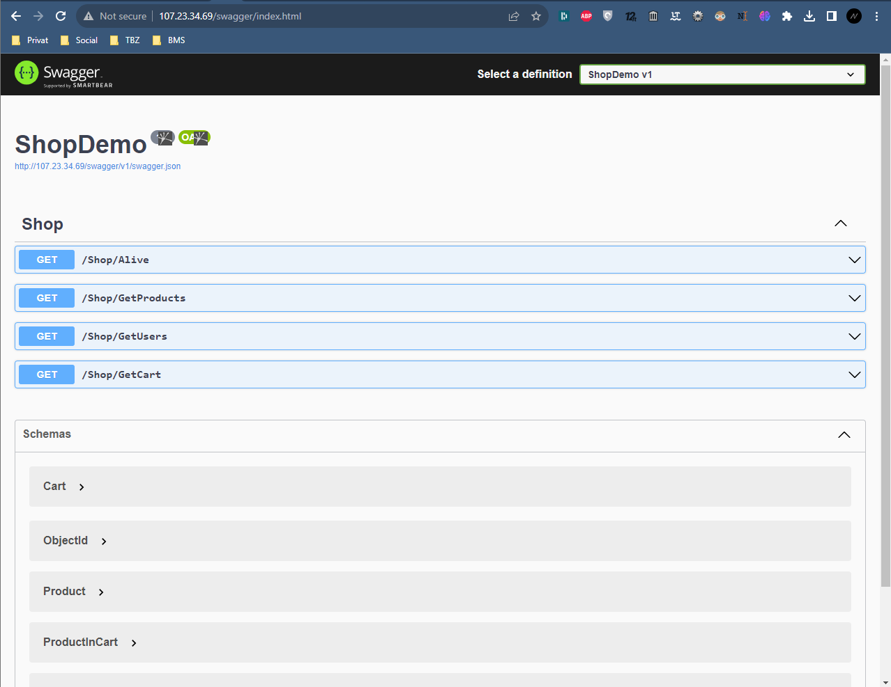
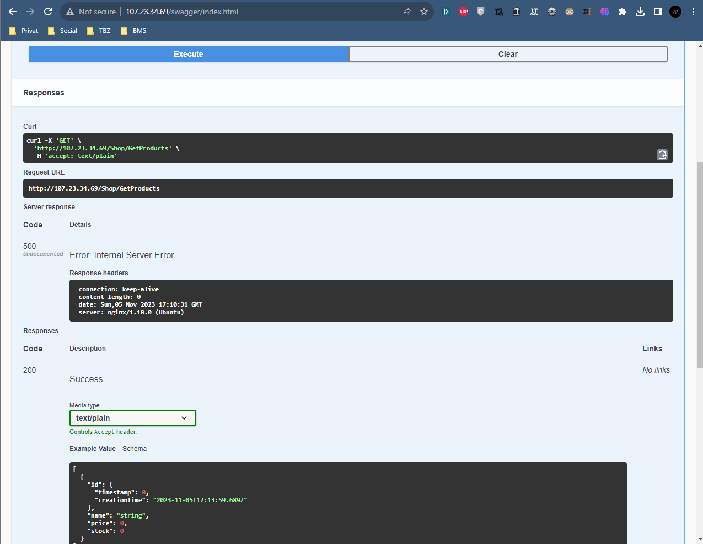
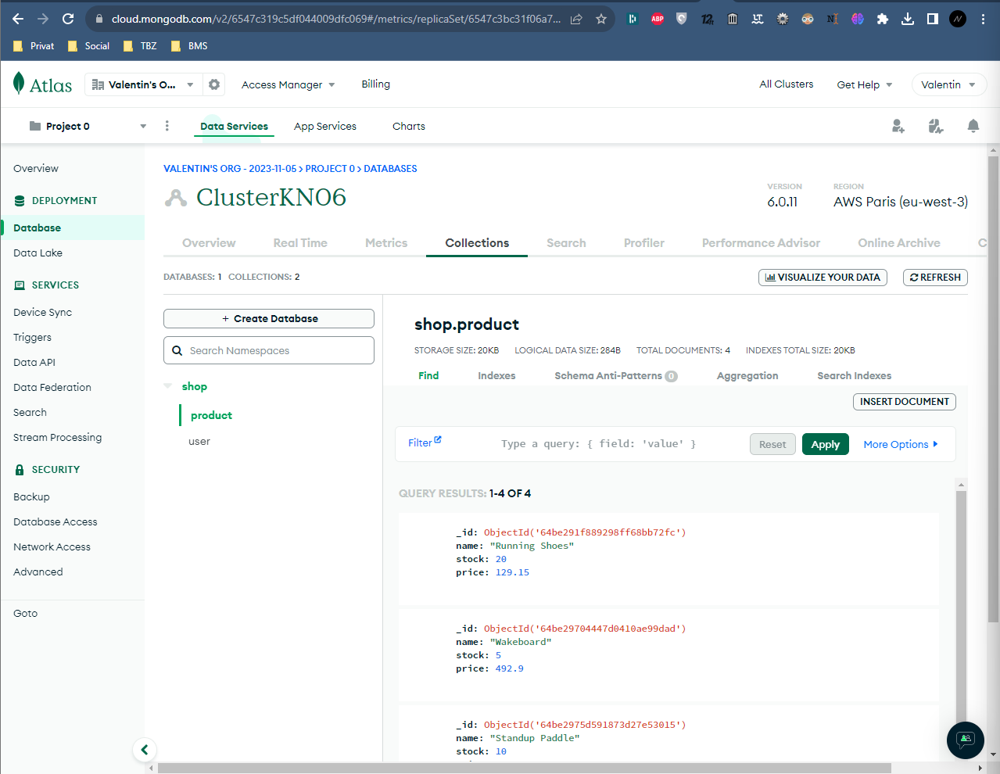
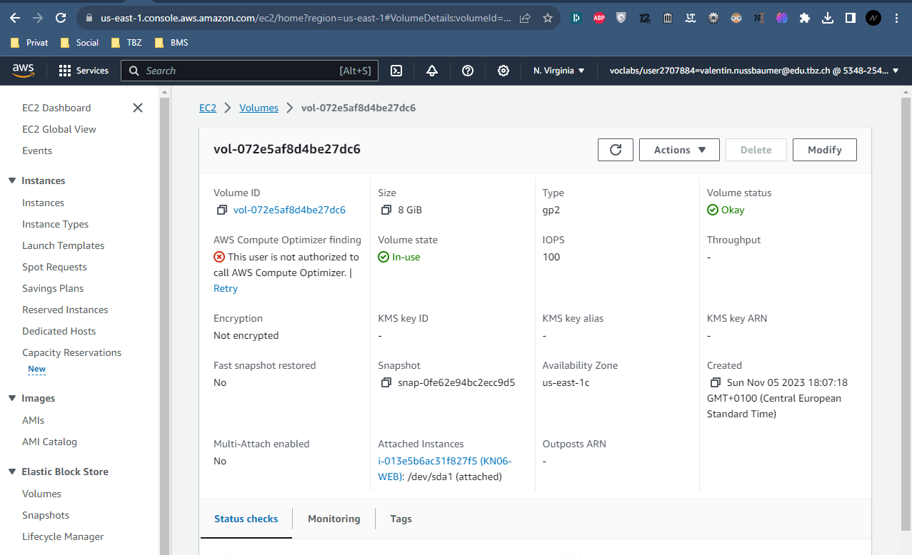
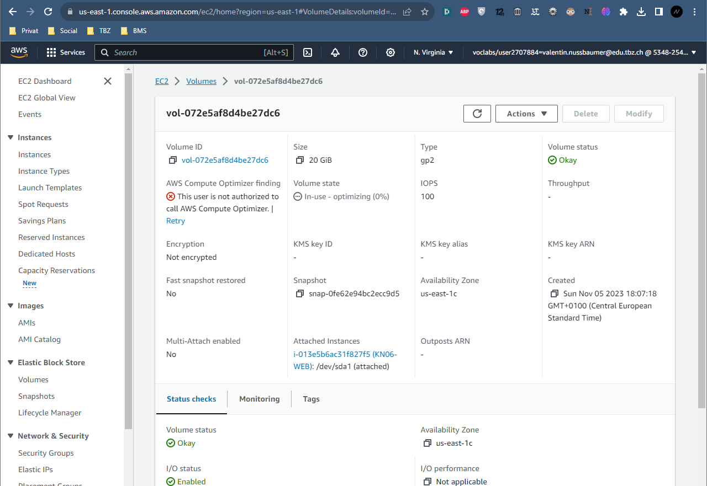
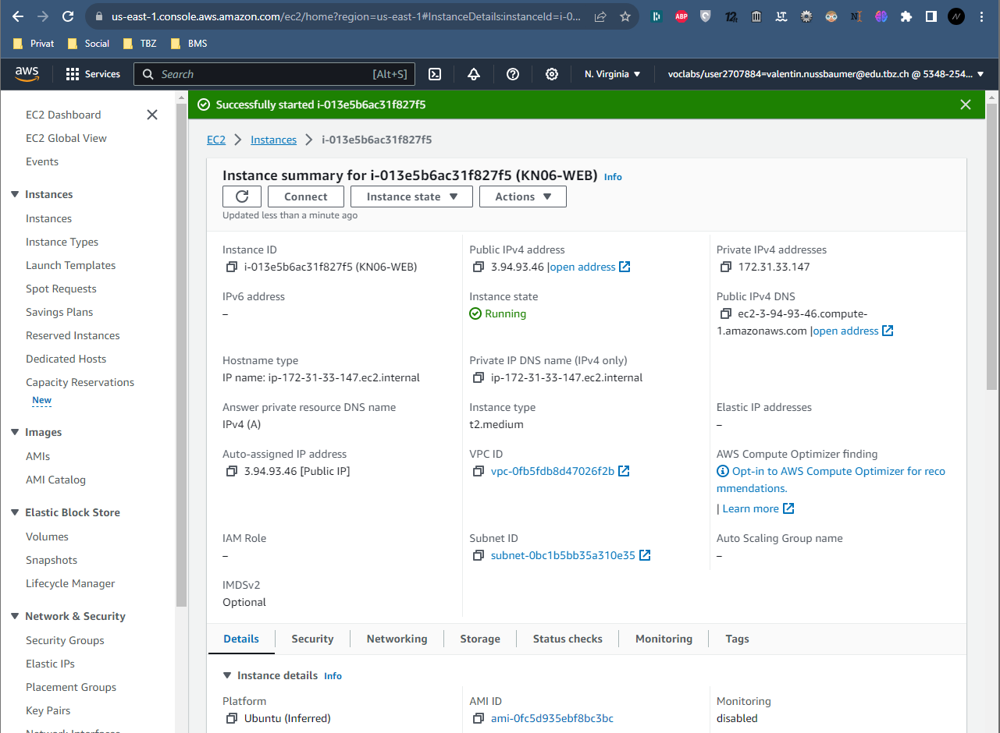

# KN06: Skalierung
## A)

Ein Reverse Proxy ist wie ein Mittelsmann für Webanfragen. Er nimmt Anfragen von Benutzern entgegen und leitet sie an die richtigen Server weiter

## B) Vertikale Skalierung
### A)

! Funktioniert auch während laufendem Betrieb

**Anleitung:**
Elestic BLock Store -> Volumes -> Volume ID wählen -> Auf Modify clicken -> Grösse auf 20gb

### B)
! Muss gestoppt sein

**Anleitung**: 
1. Instance Stoppen
2. Instances -> Instances -> Instance ID wählen -> Actions -> Instance settings -> Change instance type -> t2.medium

## C) Horizontale Skalierung
