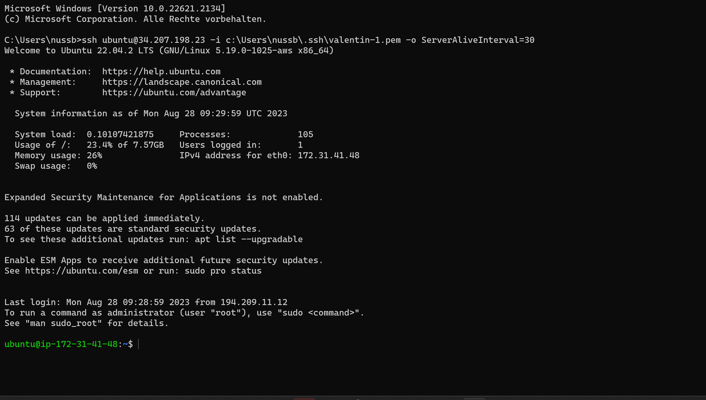
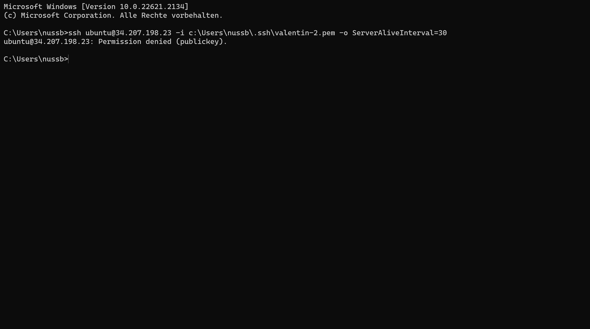
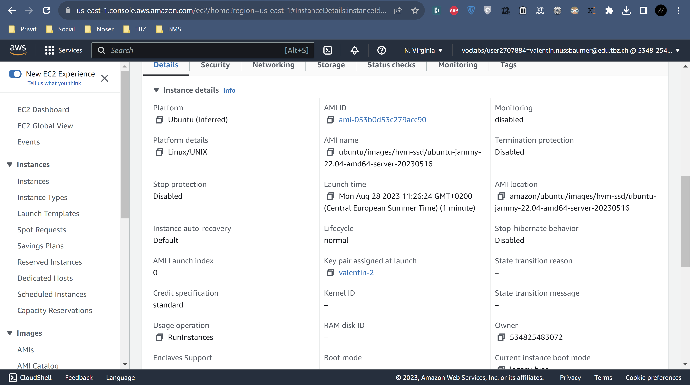
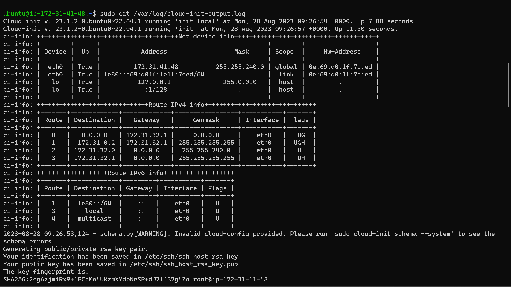
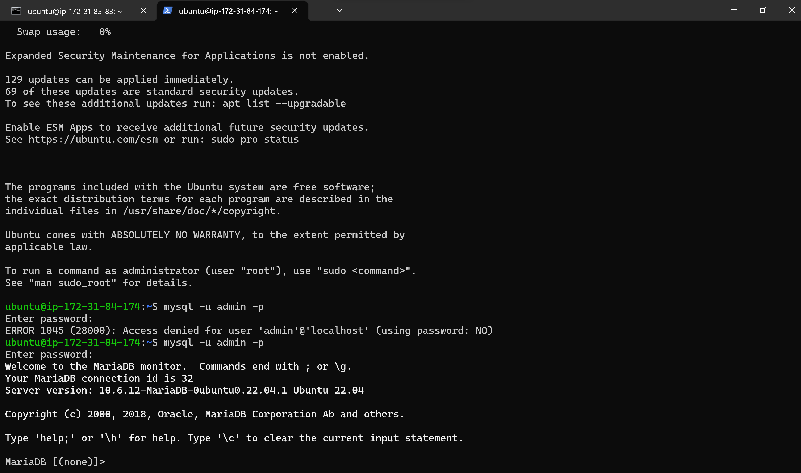
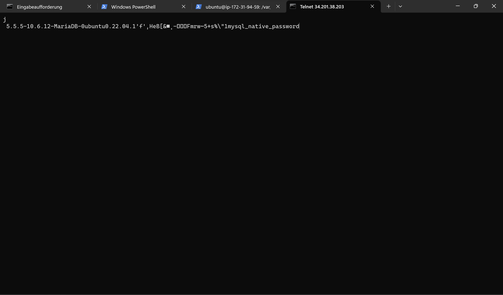
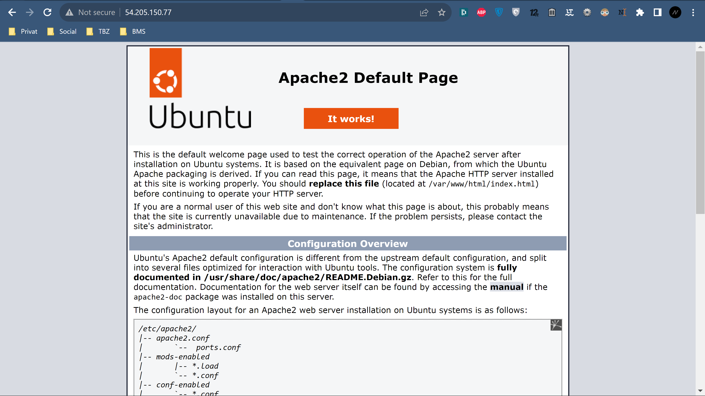
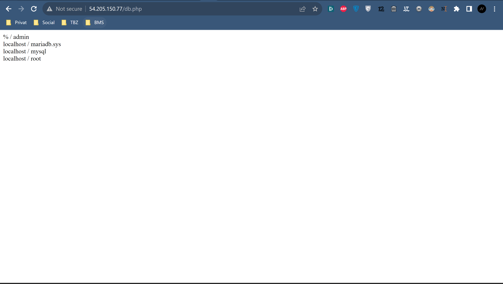
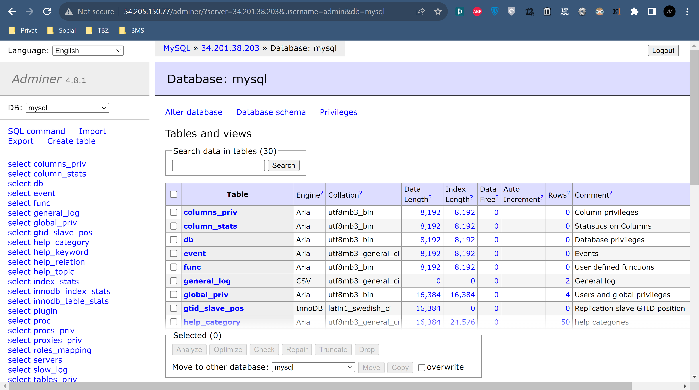

# KN03: Cloud-init und AWS
## A) Cloud-init Datei Verstehen
```#cloud-config                        

users:                                  # Benutzerkonfiguration
  - name: ubuntu                        # Benutzername
    sudo: ALL=(ALL) NOPASSWD:ALL        # sudo-regeln für diesen benutzer
    groups: users, admin                # Benutzer ist Mitglied in den Gruppen "users" und "admin"
    home: /home/ubuntu                  # Benutzerverzeichnis: /home/ubuntu
    shell: /bin/bash                    # Verwendete Shell: /bin/bash
    ssh_authorized_keys:                # SSH-öffentlicher Schlüssel zur Authentifizierung
      - ssh-rsa AAAAB3NzaC1yc2EAAAADAQABAAABAQC0WGP1EZykEtv5YGC9nMiPFW3U3DmZNzKFO5nEu6uozEHh4jLZzPNHSrfFTuQ2GnRDSt+XbOtTLdcj26+iPNiFoFha42aCIzYjt6V8Z+SQ9pzF4jPPzxwXfDdkEWylgoNnZ+4MG1lNFqa8aO7F62tX0Yj5khjC0Bs7Mb2cHLx1XZaxJV6qSaulDuBbLYe8QUZXkMc7wmob3PM0kflfolR3LE7LResIHWa4j4FL6r5cQmFlDU2BDPpKMFMGUfRSFiUtaWBNXFOWHQBC2+uKmuMPYP4vJC9sBgqMvPN/X2KyemqdMvdKXnCfrzadHuSSJYEzD64Cve5Zl9yVvY4AqyBD aws-key    # Öffentlicher SSH-Schlüssel
ssh_pwauth: false                       # SSH-Passwort-Authentifizierung ist deaktiviert
disable_root: false                     # Das Deaktivieren des Root-Benutzers ist deaktiviert
package_update: true                    # Paketaktualisierungen werden durchgeführt
packages:                               # Zusätzliche Pakete, die installiert werden
  - curl                                # Paket: curl
  - wget                                # Paket: wget
```
<<<<<<< HEAD

## B)




## C)
Durchgeführt
## D)
### DB-Server



### Web-Server





=======
## B) SSH-Key und Cloud-init


>>>>>>> 6b30efb6ec97774bf6b7b514e67298828c44021d
