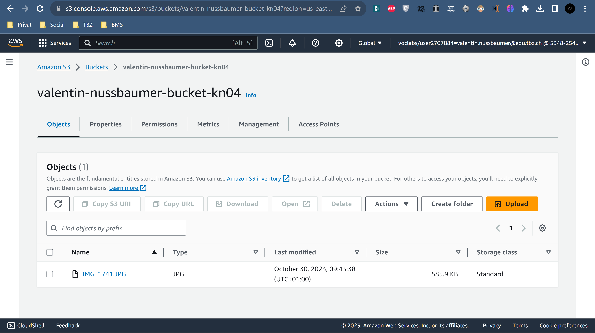

# KN04: Cloud-init / Storage
## A) Bild erstellen und auf S3 hosten

## B) Web-Server mit PHP-Seite hinzufügen

## C) Elastic Block Storage (EBS) hinzufügen.

## D) Speichereigenschaften erkennen
|     | Typ | Persistenz |
| ----------- | ----------- | ----------- |
| EBS Root | Hot  | Nein |
| EBS Zusätzliches Volumen | Hot | Ja |
| S3  | Warm | Ja |

Wenn ein EBS-Volume so eingestellt ist, dass es beim Beenden gelöscht wird, gilt es als nicht persistent, da es so konzipiert ist, dass es automatisch gecleaned wird, wenn die instanz gelöscht wird.

Da ich keine Speichereinstellungen für meinen Bucket geändert habe, wird er die Standard-Speicheroption "warm" haben. Amazon S3-Speicher ist darauf ausgelegt, persistent zu sein. 