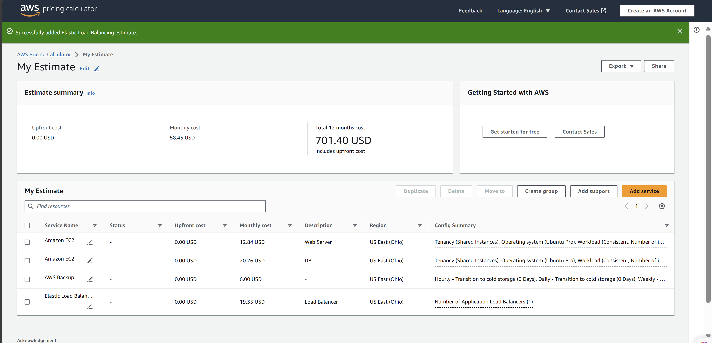
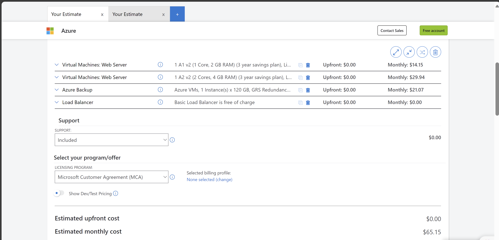
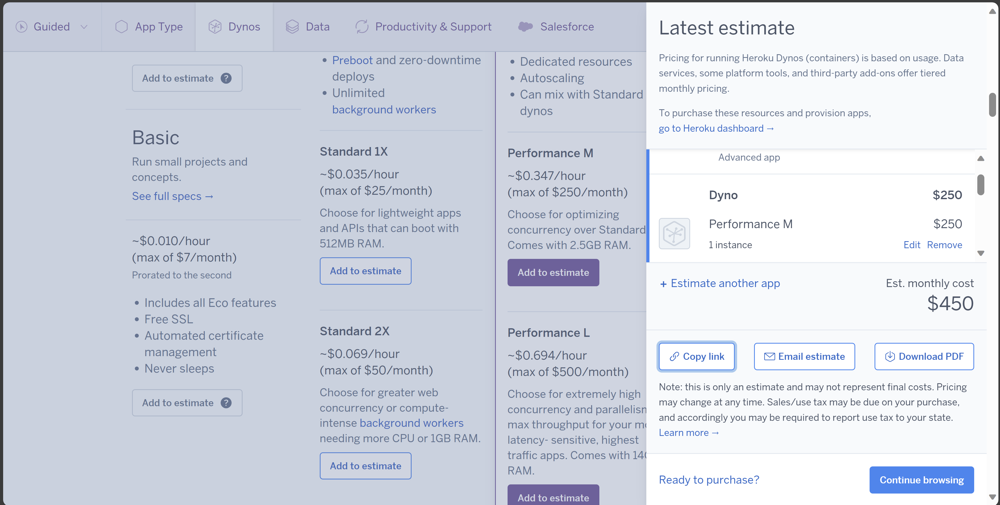
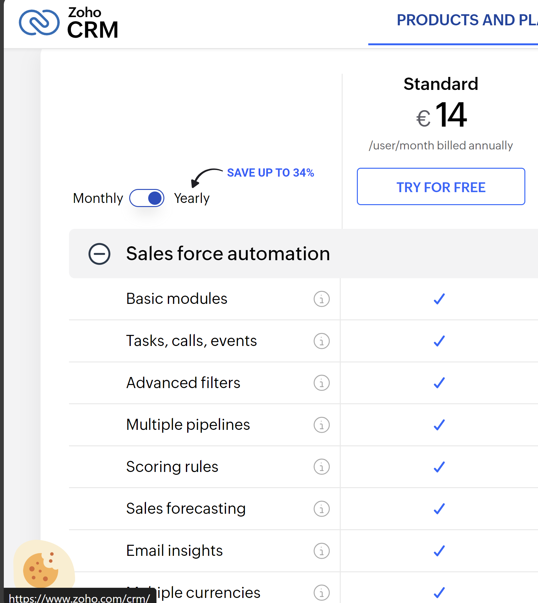
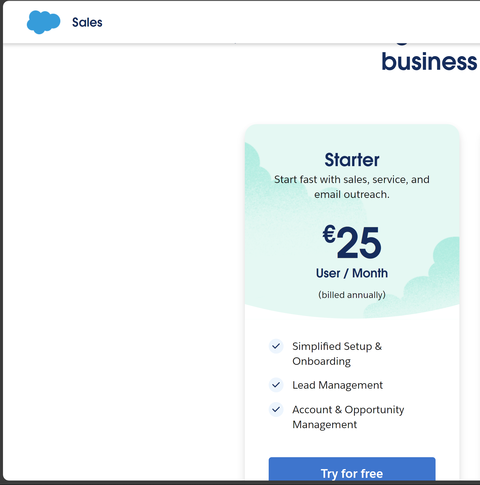

# KN07: Kostenberechnung
## A) Kostenrechnung erstellen
### 1) Rehosting
#### AWS

#### Azure

#### Vergleich
AWS ist günstiger bei gleicher Dienstleistung wie Azure. Ich persönlich würde auch AWS wählen, aber Azure ist auch eine super Option. Bei Azure würde man auch direkt noch ein 200$ credit zu bekommen. 

#### Auswahl
Ich habe immer versucht die günstigst mögliche Option zu wählen, welche den Anforderungen entspricht. Die Auswahlen von sowohl AWS als auch Azure stimmen überein, soweit es möglich ist. 

### 2) Replatforming

Da Heroku nur begrenzte Möglichkeiten für die Konfiguration. Ich habe immer die Konfiguration gewählt, die mindestens die erwarteten Anforderungen erfüllt. Deshalb ist meine Konfiguration nachmals auch zu gut, als dass sie sein müsste und dadurch sehr teuer.

### 3) Repurchasing

14 X 16 = 224$ per Monat

25 X 16 = 400$ per Monat

#### Auswahl
Ich habe mich auch hier für die günstigst mögliche Option entscheiden. Hierbei sind die preise aber au erneut sehr hoch.

#### Vergleich
SaaS: Zoho ist zum Beispiel ein SaaS. Hierbei muss man sich um keine Konfiguration im Hintergrund kümmern, sondern bekommt sozusagen das fertige Produkt. Eine SaaS Lösung ist meisten sehr einfach einzurichten, ist aber auch meistens relative teuer.  
PaaS: Heroku ist zum Beispiel ein PaaS. Hier muss man sich nicht um die Konfiguration des Servers kümmern. Man muss im Gegensatz zu einer SaaS aber auch noch Programmieren. Eine PaaS ist nicht so kompliziert im Aufsetzen wie eine IaaS und oft preiswerter als eine SaaS solange man natürlich die Software nicht selbst entwickeln muss.  
IaaS: AWS EC2 ist zum Beispiel eine IaaS. Hierbei muss man alles selbst konfigurieren und aufsetzen. Man hat mehr Möglichkeiten als bei den anderen Optionen und ist oft auch die günstigste Option. Es ist aber auch viel komplizierter und kann nur mit gewissen Kenntnissen erstellt werden.

## B) Interpretation der Resultate
Der Preisunterschied bei den verschiedenen Optionen ist enorm.  
Der günstigste Service ist das Rehosting bei AWS.  
Das Replatforming von Heroku ist am teuersten. Man muss aber auch sagen, dass ich dort eine bessere Konfiguration, als bei den anderen Optionen ausgewählt habe. Das kommt daher, da man bei Heroku nur begrenzte Auswahlmöglichkeiten hat.  
Ich persönlich würde entweder die Dienstleistung von AWS oder Zoho wählen.  

