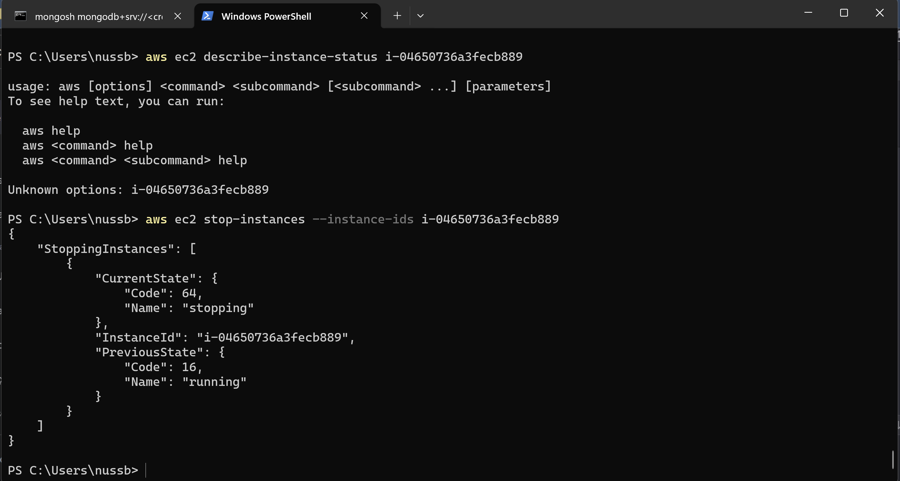
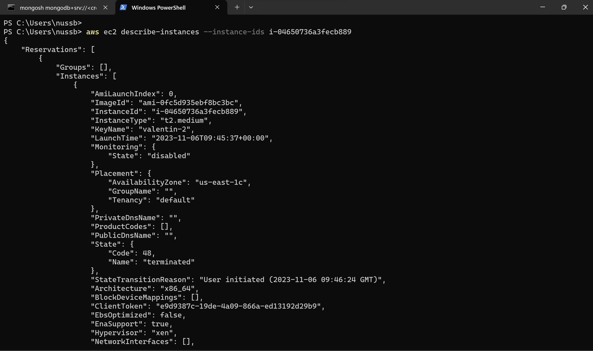
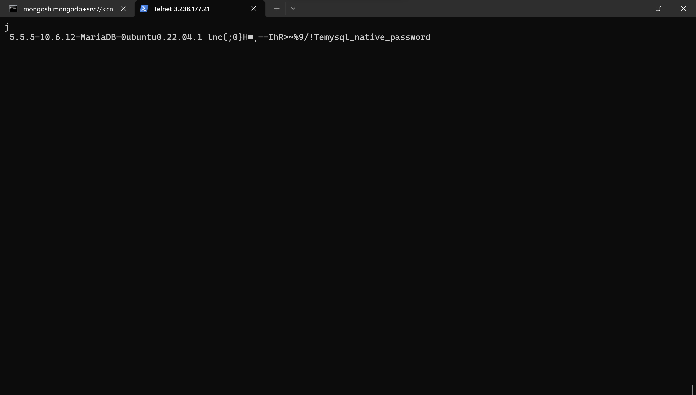

# KN09: Automation
## A) Automatisierung mit Command Line Interface(CLI)
**Commands**
1. aws ec2 stop-instances --instance-ids i-04650736a3fecb889
2. aws ec2 start-instances --instance-ids i-04650736a3fecb889
3. aws ec2 describe-instances --instance-ids i-04650736a3fecb889
4. aws ec2 run-instances --image-id ami-0fc5d935ebf8bc3bc --instance-type t2.micro --key-name valentin-2 --subnet-id  subnet-0a433328e77e4ed9f --security-group-ids sg-0d6c9ac5eaf4e5aa4 --user-data file://C:\Source\m346\KN05\cloud-init-db.yaml
5. telnet 3.238.177.21 3306

Neue Instanz

! Telnet funktionierte erst nach manuellem Anpassen der SG

### KN4 throw CLI
1. aws s3api create-bucket --bucket kn09-bucket
2. aws s3 cp image-to-host.jpg s3://kn09-bucket/
3. aws ec2 run-instances --image-id ami-0fc5d935ebf8bc3bc --instance-type t2.micro --key-name valentin-2 --subnet-id  subnet-0a433328e77e4ed9f --security-group-ids sg-0d6c9ac5eaf4e5aa4 --user-data file://C:\Source\m346\KN04\cloud-init-web.yaml
   
## B) Terraform
